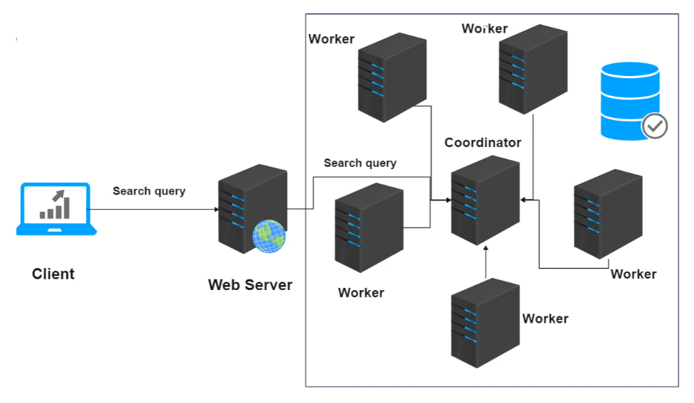

# Project Title

Distributed Search in a Cluster Files
Cluster Auto-Healer using Zookeeper and Load Sharing between Workers with Herd Effect Avoidance
to search in text files.
## Description

in order to keep a distribued system or app running correctly with load balancing, certain characteristics must be acheived. we present simple idea of keeping a fixed number of wrokers in the cluster by watching the cluster by running master using zookeeper so when a worker fails, we launch a new worker. wrokers join the cluster register as znode in zookeeper and master keeps an eye on them.
We Have An Entry Point which is very simple Web Server that receives a search query and forward this search query to the cluster.
cluster has a master that sends the query to all workers and each wroker is responsible for a segment of the text files we have (all workers have the same text files), then we calculate the relevance of each file to the query using Entropy and set the file a score.
The Master(Coordinator) recieves answers and aggregate them by sorting the results descending by score and return answer to web server. then the client has the results.

Communication between web server and Coordinator is via GRPC

## Getting Started

### Dependencies

* zookeeper-3.9.1-dependency
* zookeeper server running in a machine (Virtual Machine or container) with identical verison of its dependency

### Installing
* change zookeeper connection info (IP + Port) as the connection to the pre-mentioned server.
* Run Nodes (Power Up VMs and Run the Project related to cluster) first then Run WebServer then open browser to localhost:5566/ 
* copy the SearchFiles folder to worker nodes in the same folder where you launch the transientworker, this was done for simplicity instead of creating a whole NFS for the files.
* be ware of GRPC files, you may need to re-create them yourself by mvn clean and mvn install - check official site. 

### simple flow
web client <--> web server (grpc) <--> coordinator <--> (all workers)

### Logging is used
logs are written in logs/app.log

## Authors

Contributors names and contact info

* Name: Mohammed Salameh
* email : mohammedsalameh37693@gmail.com
* LinkedIn : www.linkedin.com/in/mohammed-salameh-8b4811313
